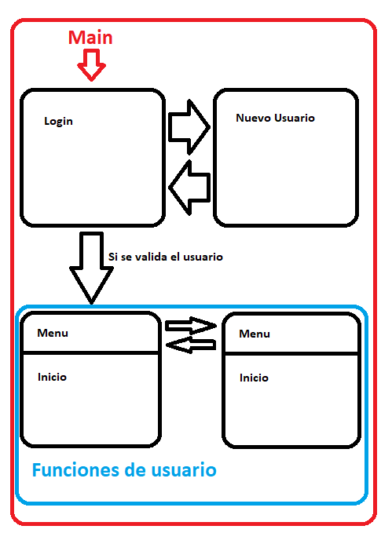

🧭 Flujo del Programa
El sistema de facturación está estructurado en distintas interfaces que responden a los casos de uso principales. A continuación se describe el flujo general de navegación:

Login (Que se levanta desde la clase Main{}):
El programa inicia cargando la ventana de Login (Inicio de sesión), que presenta al usuario las opciones de iniciar sesión o dirigirse a la seccion de registrar un nuevo usuario.

Si el usuario valida su sesión:
Una vez que se ingresan las credenciales y se valida el usuario y contraseña correctamente, se accede al Panel de Inicio.

Panel de Inicio:
Este panel da un saludo inicial. Contiene un menú principal desde el cual se accede a las distintas secciones de la aplicación (como gestión de ventas, clientes, empleados, etc.).

Menu (Navegación entre secciones):
El menú permanece accesible en cada seccion para facilitar la navegación entre las diferentes secciones del sistema.

Este diseño modular permite un flujo claro y controlado de la interacción con el usuario, mejorando tanto la experiencia como la mantenibilidad del sistema.

